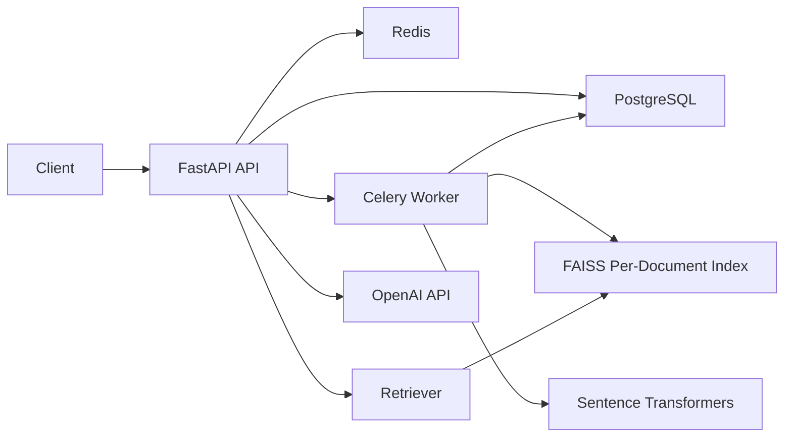

# Smart Document Q&A System

A FastAPI service that accepts PDF/DOCX uploads, processes them asynchronously, indexes document chunks in FAISS, and answers natural-language questions with OpenAI using retrieved document context.

## What It Supports

- PDF and DOCX uploads
- Async document ingestion with Celery + Redis
- Status polling for document processing progress
- Conversation-based Q&A with follow-up questions
- Retrieval-backed answers with structured citations
- Safe fallbacks for missing answers, broken documents, and LLM outages
- Dockerized local stack with PostgreSQL, Redis, API, and worker

## Stack

- API: FastAPI
- Database: SQLAlchemy + Alembic + PostgreSQL
- Background jobs: Celery + Redis
- Vector search: FAISS
- Embeddings: Sentence Transformers (`all-MiniLM-L6-v2`)
- LLM: OpenAI Responses API

## Architecture



## Quick Start

### 1. Configure environment

Copy `.env.example` to `.env` and set `OPENAI_API_KEY`.

The stack will still boot without an API key, but question answering will return `answer_status=unavailable` until the key is configured.

### 2. Start everything

```bash
docker compose up --build
```

Services:

- API: `http://localhost:8000`
- OpenAPI docs: `http://localhost:8000/docs`
- PostgreSQL: `localhost:5432`
- Redis: `localhost:6379`

## Sample Documents

Three ready-to-upload sample files are included in `sample_documents/`:

- `recruiting_playbook.pdf`
- `offer_approval_policy.pdf`
- `interview_scorecard_guidelines.docx`

## API Flow

### 1. Upload a document

```bash
curl -X POST http://localhost:8000/api/v1/documents \
  -F "file=@sample_documents/recruiting_playbook.pdf"
```

Example response:

```json
{
  "id": "84f1d518-b90f-4c92-8463-565b9d1c8c88",
  "original_filename": "recruiting_playbook.pdf",
  "status": "queued",
  "progress": 0
}
```

### 2. Poll processing status

```bash
curl http://localhost:8000/api/v1/documents/84f1d518-b90f-4c92-8463-565b9d1c8c88
```

When processing completes, the document moves to `ready` and exposes `chunk_count` and `page_count`.

### 3. Create a conversation

```bash
curl -X POST http://localhost:8000/api/v1/conversations \
  -H "Content-Type: application/json" \
  -d '{
    "title": "Recruiting policy review",
    "document_ids": ["84f1d518-b90f-4c92-8463-565b9d1c8c88"]
  }'
```

### 4. Ask a question

```bash
curl -X POST http://localhost:8000/api/v1/conversations/<conversation-id>/messages \
  -H "Content-Type: application/json" \
  -d '{
    "question": "How quickly should interview feedback be submitted?"
  }'
```

Example response shape:

```json
{
  "conversation_id": "f4687b6b-67a0-4e66-a0f8-c5bdfde0ce71",
  "answer_status": "answered",
  "searched_document_ids": ["84f1d518-b90f-4c92-8463-565b9d1c8c88"],
  "pending_document_ids": [],
  "citations": [
    {
      "document_id": "84f1d518-b90f-4c92-8463-565b9d1c8c88",
      "original_filename": "recruiting_playbook.pdf",
      "page_number": 1,
      "chunk_index": 0,
      "score": 0.7215,
      "excerpt": "Candidates should receive interview feedback within 24 hours of each panel."
    }
  ],
  "assistant_message": {
    "content": "Interview feedback should be submitted within 24 hours of each panel. [1]"
  }
}
```

### Main endpoints

- `POST /api/v1/documents`
- `GET /api/v1/documents`
- `GET /api/v1/documents/{document_id}`
- `POST /api/v1/conversations`
- `GET /api/v1/conversations/{conversation_id}`
- `POST /api/v1/conversations/{conversation_id}/messages`
- `GET /health`

## Design Decisions

### 1. Chunking strategy

Documents are extracted into page-aware text blocks and then chunked with sentence-aware windows plus overlap. This keeps chunks semantically coherent while reducing the odds of slicing a policy sentence in half.

Why this choice:

- Better retrieval precision than fixed-size blind splitting
- Preserves page metadata for citations
- Overlap helps follow-up questions that depend on neighboring sentences

### 2. FAISS indexing strategy

Each document gets its own FAISS inner-product index stored on disk. At query time, the API searches the attached documents and merges the top matches.

Why this choice:

- Simple metadata filtering by conversation scope
- Easy to reason about operationally
- Works well for small-to-medium B2B document sets without introducing another service

### 3. Follow-up question handling

The system keeps conversation history in PostgreSQL and uses a lightweight retrieval-query expansion heuristic for short or referential follow-ups like “What about above midpoint?”.

Why this choice:

- Improves retrieval without needing a second LLM call just to rewrite the question
- Keeps the behavior deterministic when the LLM is unavailable

### 4. Hallucination control

The answering prompt is intentionally strict:

- use only retrieved context
- say the answer is unavailable if evidence is weak
- keep answers concise
- cite supporting snippets inline

There is also a retrieval score threshold before the LLM is called. If the evidence is too weak, the API returns `answer_status=not_found` instead of asking the model to guess.

### 5. Async ingestion

Upload requests only persist the file and create a `documents` row. Parsing, chunking, embedding, and FAISS indexing happen in a Celery worker.

Why this choice:

- Large documents do not block the request/response cycle
- Progress can be polled via the document resource
- Failures stay attached to the document record for later inspection

### 6. Failure handling

- Corrupt or unreadable document: document status becomes `failed` with `error_message`
- LLM unavailable or API key missing: assistant message returns `answer_status=unavailable`
- No strong evidence in the docs: assistant message returns `answer_status=not_found`
- Documents still processing: question endpoint returns `409 Conflict`

## Project Structure

```text
app/
  api/routes/           # FastAPI routes
  core/                 # settings, DB, Celery
  models/               # SQLAlchemy models
  schemas/              # response/request models
  services/             # parsing, chunking, embeddings, retrieval, QA
  tasks/                # Celery background jobs
alembic/                # DB migrations
sample_documents/       # 3 sample files for evaluation
scripts/                # helper scripts, including sample document generation
```

## Deployment

This repository is deploy-ready from a container perspective because the API and worker share a single Docker image and all infrastructure dependencies are externalized through environment variables.

Live deployment link:

- Add your hosted base URL here before submission

The only reason a live link is not embedded directly in this local workspace is that cloud credentials are not available here. The fastest path is to deploy the same Docker image pair to Render, Railway, Fly.io, ECS, or any platform that supports a web service plus a worker service.

## Notes for Reviewers

- The OpenAPI spec at `/docs` is the easiest way to explore the API.
- The repository includes sample inputs so you can test the workflow immediately.
- The API is intentionally explicit about processing state and answer quality because this is meant for B2B workflows where silent failure is worse than a visible “not enough evidence” response.
