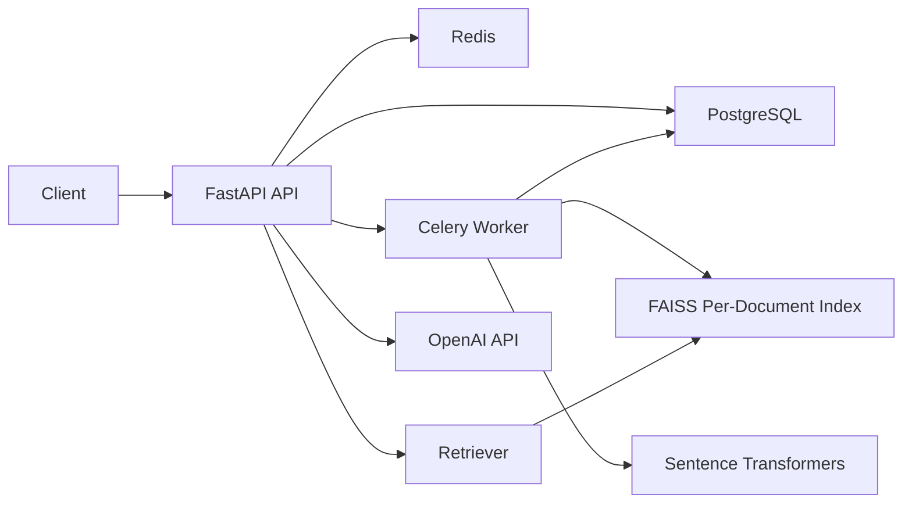

# Smart Document Q&A System

A FastAPI service that lets users upload PDF or DOCX files, processes them asynchronously, indexes document chunks in FAISS, and answers natural-language questions with retrieved document context.

## What It Supports

- PDF and DOCX uploads
- Async document ingestion with Celery + Redis
- Status polling for document processing progress
- Conversation-based Q&A with follow-up questions
- Retrieval-backed answers with structured citations
- Safe fallbacks for missing answers, broken documents, and LLM outages
- Dockerized local stack with PostgreSQL, Redis, API, and worker

## Stack

- API: FastAPI
- Database: SQLAlchemy + Alembic + PostgreSQL
- Background jobs: Celery + Redis
- Vector search: FAISS
- Embeddings: Sentence Transformers (`all-MiniLM-L6-v2`)
- LLM: OpenAI API

## Architecture



## Quick Start

### 1. Configure environment

Copy `.env.example` to `.env` and set `OPENAI_API_KEY`.

The stack still boots without an API key, but question answering returns `answer_status=unavailable` until the key is configured.

### 2. Start everything

```bash
docker compose up --build
```

Services:

- API: `http://localhost:8000`
- OpenAPI docs: `http://localhost:8000/docs`
- PostgreSQL: `localhost:5432`
- Redis: `localhost:6379`

### 3. Open the API docs

Open `http://localhost:8000/docs`.

## Sample Documents

Three ready-to-upload sample files are included in `sample_documents/`:

- `recruiting_playbook.pdf`
- `offer_approval_policy.pdf`
- `interview_scorecard_guidelines.docx`

## Reviewer Walkthrough

This is the quickest way to test the API in Swagger UI.

### Step 1. Upload a document

Endpoint: `POST /api/v1/documents`

What to do:

- choose a PDF or DOCX file
- click `Execute`
- copy the returned `id` as your `document_id`

What happens next:

- the API returns `202 Accepted`
- the document starts in `queued`
- the worker parses, chunks, embeds, and indexes it in the background

### Step 2. Wait for the document to be ready

Endpoint: `GET /api/v1/documents/{document_id}`

What to do:

- paste the `document_id`
- run the endpoint every few seconds

What success looks like:

- `status` becomes `ready`
- `progress` becomes `100`
- `chunk_count` is greater than `0`

### Step 3. Create a conversation

Endpoint: `POST /api/v1/conversations`

What to do:

- attach one or more ready document IDs
- copy the returned `id` as your `conversation_id`

Request body:

```json
{
  "title": "Offer policy review",
  "document_ids": ["YOUR_DOCUMENT_ID"]
}
```

### Step 4. Ask the first question

Endpoint: `POST /api/v1/conversations/{conversation_id}/messages`

What to do:

- paste the `conversation_id`
- put your question in the `question` field

Request body:

```json
{
  "question": "Who needs to approve offers above the midpoint of the salary band?"
}
```

What success looks like:

- `answer_status` is `answered`, `not_found`, or `unavailable`
- `assistant_message.content` contains the answer
- `citations` show the supporting snippets used for the answer

### Step 5. Ask follow-up questions

Use the same endpoint again:

- `POST /api/v1/conversations/{conversation_id}/messages`

Example follow-up:

```json
{
  "question": "How quickly should approved offers be sent?"
}
```

The same conversation keeps the thread context for follow-up questions.

## API Flow

### 1. Upload a document

```bash
curl -X POST http://localhost:8000/api/v1/documents \
  -F "file=@sample_documents/recruiting_playbook.pdf"
```

Example response:

```json
{
  "id": "84f1d518-b90f-4c92-8463-565b9d1c8c88",
  "original_filename": "recruiting_playbook.pdf",
  "status": "queued",
  "progress": 0
}
```

### 2. Poll processing status

```bash
curl http://localhost:8000/api/v1/documents/84f1d518-b90f-4c92-8463-565b9d1c8c88
```

When processing completes, the document moves to `ready` and exposes `chunk_count` and `page_count`.

### 3. Create a conversation

```bash
curl -X POST http://localhost:8000/api/v1/conversations \
  -H "Content-Type: application/json" \
  -d '{
    "title": "Recruiting policy review",
    "document_ids": ["84f1d518-b90f-4c92-8463-565b9d1c8c88"]
  }'
```

### 4. Ask a question

```bash
curl -X POST http://localhost:8000/api/v1/conversations/<conversation-id>/messages \
  -H "Content-Type: application/json" \
  -d '{
    "question": "How quickly should interview feedback be submitted?"
  }'
```

Example response shape:

```json
{
  "conversation_id": "f4687b6b-67a0-4e66-a0f8-c5bdfde0ce71",
  "answer_status": "answered",
  "searched_document_ids": ["84f1d518-b90f-4c92-8463-565b9d1c8c88"],
  "pending_document_ids": [],
  "citations": [
    {
      "document_id": "84f1d518-b90f-4c92-8463-565b9d1c8c88",
      "original_filename": "recruiting_playbook.pdf",
      "page_number": 1,
      "chunk_index": 0,
      "score": 0.7215,
      "excerpt": "Candidates should receive interview feedback within 24 hours of each panel."
    }
  ],
  "assistant_message": {
    "content": "Interview feedback should be submitted within 24 hours of each panel. [1]"
  }
}
```

## Endpoint Guide

- `POST /api/v1/documents`: upload a PDF or DOCX and start background processing
- `GET /api/v1/documents`: list uploaded documents and their current state
- `GET /api/v1/documents/{document_id}`: check whether a document is ready for Q&A
- `POST /api/v1/conversations`: create a Q&A thread and attach one or more documents
- `GET /api/v1/conversations/{conversation_id}`: fetch the conversation, linked docs, and message history
- `POST /api/v1/conversations/{conversation_id}/messages`: ask a question or follow-up in the same thread
- `GET /health`: verify that the API is up

## Design Decisions

### 1. Chunking strategy

Documents are extracted into page-aware text blocks and then chunked with sentence-aware windows plus overlap. This keeps chunks semantically coherent while reducing the odds of slicing a policy sentence in half.

Why this choice:

- better retrieval precision than fixed-size blind splitting
- preserves page metadata for citations
- overlap helps follow-up questions that depend on neighboring sentences

### 2. FAISS indexing strategy

Each document gets its own FAISS inner-product index stored on disk. At query time, the API searches the attached documents and merges the top matches.

Why this choice:

- simple metadata filtering by conversation scope
- easy to reason about operationally
- works well for small-to-medium B2B document sets without introducing another service

### 3. Follow-up question handling

The system keeps conversation history in PostgreSQL and uses a lightweight retrieval-query expansion heuristic for short or referential follow-ups like "What about above midpoint?".

Why this choice:

- improves retrieval without needing a second LLM call just to rewrite the question
- keeps behavior deterministic when the LLM is unavailable

### 4. Hallucination control

The answering prompt is intentionally strict:

- use only retrieved context
- say the answer is unavailable if evidence is weak
- keep answers concise
- cite supporting snippets inline

There is also a retrieval score threshold before the LLM is called. If the evidence is too weak, the API returns `answer_status=not_found` instead of asking the model to guess.

### 5. Async ingestion

Upload requests only persist the file and create a `documents` row. Parsing, chunking, embedding, and FAISS indexing happen in a Celery worker.

Why this choice:

- large documents do not block the request/response cycle
- progress can be polled via the document resource
- failures stay attached to the document record for later inspection

### 6. Failure handling

- corrupt or unreadable document: document status becomes `failed` with `error_message`
- LLM unavailable or token missing: assistant message returns `answer_status=unavailable`
- no strong evidence in the docs: assistant message returns `answer_status=not_found`
- documents still processing: question endpoint returns `409 Conflict`

### 7. LLM provider choice

The repository is configured to be OpenAI-first for the assignment:

- `LLM_PROVIDER=openai`
- `OPENAI_API_KEY=...`
- `OPENAI_MODEL=gpt-4.1-mini`

For the temporary live demo, the same codebase can also run against Hugging Face's OpenAI-compatible router by setting:

- `LLM_PROVIDER=huggingface`
- `HF_BASE_URL=https://router.huggingface.co/v1`
- `HF_MODEL=openai/gpt-oss-120b:groq`
- `HF_TOKEN=...`

This keeps the repo aligned with the assignment requirement while allowing the live demo environment to use a different provider without changing the API surface.

## Project Structure

```text
app/
  api/routes/           # FastAPI routes
  core/                 # settings, DB, Celery
  models/               # SQLAlchemy models
  schemas/              # response/request models
  services/             # parsing, chunking, embeddings, retrieval, QA
  tasks/                # Celery background jobs
alembic/                # DB migrations
sample_documents/       # 3 sample files for evaluation
scripts/                # helper scripts, including sample document generation
```

## Deployment

This repository now includes a Render blueprint in [render.yaml](/C:/Users/gsaik/Downloads/smart%20docuemnt/render.yaml) for a hosted demo deployment.

The Render setup uses:

- one public web service for FastAPI
- one managed Render Postgres database
- one managed Render Key Value instance for Redis-compatible Celery transport
- a small startup script in [scripts/start_render.sh](/C:/Users/gsaik/Downloads/smart%20docuemnt/scripts/start_render.sh) that runs the API and Celery worker in the same container for the hosted demo path

This keeps uploads, chunking, retrieval, and question answering working in a simple hosted setup without changing the local `docker compose` architecture.

Live deployment link:

- Add your hosted base URL here before submission

### Render deployment steps

1. Push this repository to GitHub.
2. In Render, choose `New +` -> `Blueprint`.
3. Connect the GitHub repository that contains this project.
4. Render will detect `render.yaml` and create:
   - `smart-document-qa`
   - `smart-document-db`
   - `smart-document-redis`
5. In Render, set the provider env vars for the web service.
   For the current demo setup, use `LLM_PROVIDER=huggingface` and set `HF_TOKEN`.
6. Wait for the deploy to finish, then copy the generated `.onrender.com` URL.
7. Replace the placeholder above with that live URL before submission.

Cloud credentials are not available in this workspace, so the final public URL still requires your GitHub and Render sign-in.

## Notes for Reviewers

- The OpenAPI spec at `/docs` is the easiest way to explore the API.
- The repository includes sample inputs so you can test the workflow immediately.
- The quickest test path is: upload document, wait for `ready`, create conversation, ask question, ask follow-up.
- The API is intentionally explicit about processing state and answer quality because this is meant for B2B workflows where silent failure is worse than a visible `not_found` response.
